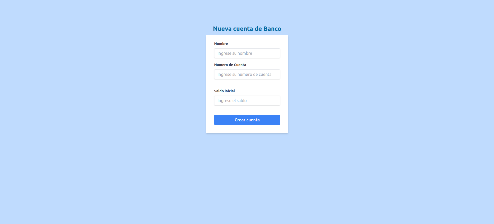
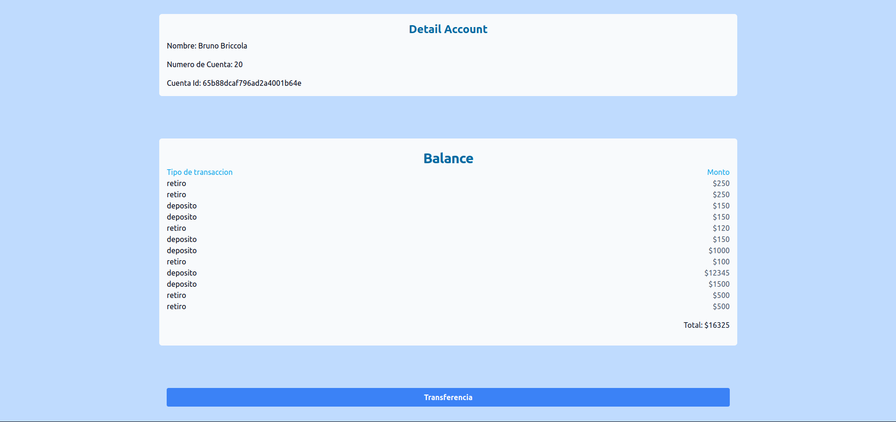
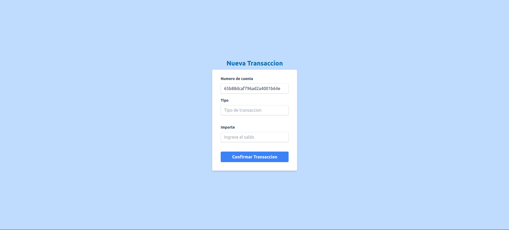

# Cuenta Bancaria Challenge

Desarrolla una aplicación de interfaz de usuario que permita a los usuarios abrir una nueva
cuenta bancaria y realizar transacciones bancarias como depósitos y retiros.

    1. La aplicación debe permitir a los usuarios introducir los detalles de su  cuenta, como el nombre, el número de cuenta y el saldo inicial.
    2. Los usuarios deben poder realizar depósitos y retiros, introduciendo el monto de la transacción y seleccionando el tipo de transacción.
    3. La aplicación debe mostrar el balance actualizado de la cuenta después de cada transacción.
    4. La aplicación debe trabajar con state management.


## Ejecutar Localmente

Clone el proyecto

```bash
  git clone git@github.com:brunobriccola4/bankAccountFront.git
```

Ir a la carpeta del proyecto

```bash
  cd account-challenge
```

Instalar dependencias

```bash
  npm install
```

Ejecutar el proyecto

```bash
  npm run dev
```

## Vistas | Pages

¡Bienvenido a mi proyecto Account Bank! Aquí hay algunas capturas de pantalla:








